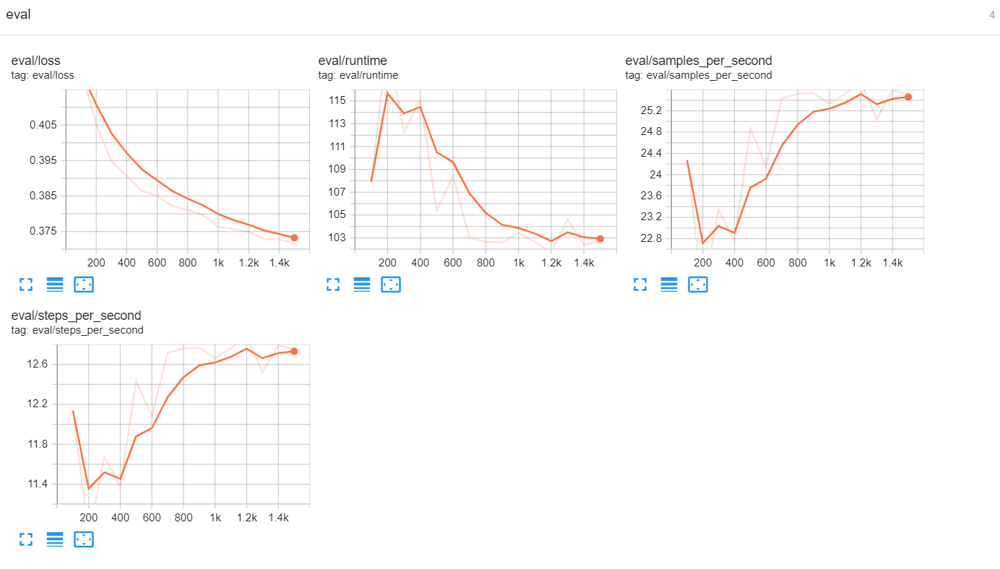
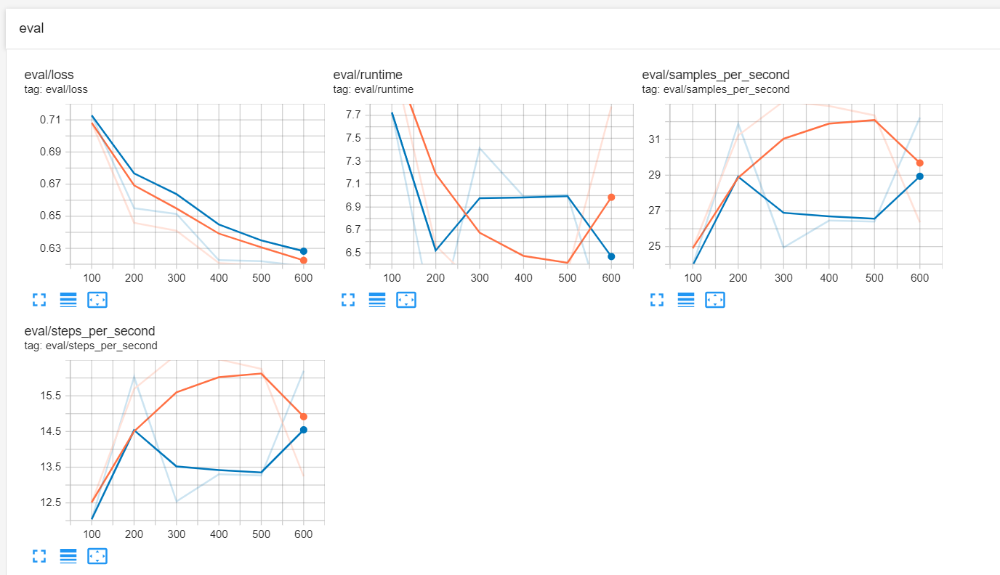

# TTS_FineTuning_GenAI_Assignment
Implementation of fine-tuning TTS models for technical vocabulary in English and in Bengali, as part of IIT Roorkee’s GenAI Internship. Includes dataset creation, model fine-tuning, and evaluation using MOS scores. Also explores optimization techniques like quantization for faster inference.

Model Links: 

1.  DeepDiveDev/Bengali_finetuned_speecht5_tts
2.  DeepDiveDev/speecht5_finetuned_English


# Table of Contents

1.  Introduction
  
2.  Model Details
  
3.  Optimization & Inference Results
  
4.  Usage
  
5. Environment & Dependencies
  
6. Conclusion & Future Work
  
7. Citations

   
***---------------------------------------------------------------------------------------------------------------------------------------------***
## Fine-tuning TTS for English with a Focus on Technical Vocabulary
# Model Overview

. Base Model: Microsoft SpeechT5 (microsoft/speecht5_tts)

. Fine-Tuned Model: DeepDiveDev/speecht5_finetuned_English

. Task: Text-to-Speech (TTS)

. Language: English

. Dataset: keithito/lj_speech

# Installation Requirements:
```
pip install transformers torch
pip install transformers soundfile
```
# Steps to Run the Code:
## Clone the Repository:
```
git clone ['https://github.com/Jyotirmoyee18/TTS_FineTuning_GenAI_Assignment.git']
cd ['SpeechT5_finetune_technicalTerm.ipynb']
```

## Load the Model and Processor:
```
from transformers import AutoProcessor, AutoModelForTextToSpectrogram

processor = AutoProcessor.from_pretrained("DeepDiveDev/speecht5_finetuned_English")
model = AutoModelForTextToSpectrogram.from_pretrained("DeepDiveDev/speecht5_finetuned_English")
```

# Run Inference:
```
text = "I will use an API with OAuth and CUDA to train the LLM model on a GPU" [your text input here]
input_features = processor(text, return_tensors="pt")
audio = model.generate(input_features["input_ids"])
```
# Training Details

- Training Data: Train split from the keithito/lj_speech dataset

- Validation Data: Test split from the same dataset (20% of total data)

- Fine-tuning Steps: 1500

- Batch Size: 4 (per device)

- Gradient Accumulation Steps: 8

- Learning Rate: 1e-4

- Warm-up Steps: 100

# Key Applications
-Accessibility tools for visually impaired users

-Educational platforms and language learning applications

-Virtual assistants and automated customer service systems

-Media localization and content creation

-Public announcements and navigation systems

# Usage
Use a Pipeline as a High-Level Helper
```
from transformers import pipeline

pipe = pipeline("text-to-audio", model="DeepDiveDev/speecht5_finetuned_English")
```

or

# Load Model Directly

```
from transformers import AutoProcessor, AutoModelForTextToSpectrogram

processor = AutoProcessor.from_pretrained("DeepDiveDev/speecht5_finetuned_English")
model = AutoModelForTextToSpectrogram.from_pretrained("DeepDiveDev/speecht5_finetuned_English")

```

## Methodology

# Model Selection
We chose microsoft/speecht5_tts as our base model due to its:

-Robust multilingual capabilities

-Strong performance on various speech synthesis tasks

-Active community support and extensive documentation

-Flexibility for fine-tuning

# Dataset Preparation
The training process utilized the keithito/lj_speech dataset characterized by:

-High-quality audio recordings from native English speakers

-Diverse phonetic coverage

-Clean transcriptions and alignments

-Balanced representation of gender

-Various speaking styles and prosody patterns

# Fine-tuning Process
The model was fine-tuned using the following hyperparameters:

. Learning rate: 0.0001

. Train batch size: 4 (32 with gradient accumulation)

. Gradient accumulation steps: 8

. Training steps: 1500

. Warmup steps: 100

. Optimizer: Adam (β1=0.9, β2=0.999, ε=1e-08)

. Learning rate scheduler: Linear with warmup

## Result
# Example Outputs
**Text:** 'Integrating OAuth 2.0 with the existing system was a challenge, but it significantly improved security.'

**Output**: [Click here to listen](https://drive.google.com/file/d/1OYQnHDWj6pV9afeU1wGCsNWrby07PuEQ/view?usp=drive_link)

# Objective Evaluation
The model showed consistent improvement throughout the training process:

Initial validation loss: 0.4231
Final validation loss: 0.3155
Training loss reduction: from 0.5156 to 0.3425
## Metrics Explanation

| Metric                    | Trend                       | Explanation                                                                                     |
|---------------------------|-----------------------------|-------------------------------------------------------------------------------------------------|
| eval/loss                 | Decreasing                   | Measures the model's error on the evaluation dataset. Decreasing trend indicates improving model performance. |
| eval/runtime              | Fluctuating, slightly decreasing | Time taken for evaluation. Minor fluctuations are normal; slight decrease may indicate optimization. |
| eval/samples_per_second   | Increasing                   | Number of samples processed per second during evaluation. Increase suggests improved processing efficiency. |
| eval/steps_per_second     | Increasing                   | Number of steps completed per second during evaluation. Increase indicates a faster evaluation process. |
| train/epoch               | Linearly increasing          | Number of times the entire dataset has been processed. Linear increase is expected.            |
| train/grad_norm           | Decreasing with fluctuations  | Magnitude of gradients. Decreasing trend with some fluctuations is normal, indicating stabilizing training. |
| train/learning_rate       | Slightly increasing           | Rate at which the model updates its parameters. Decrease over time is typical in many learning rate schedules. |
| train/loss                | Decreasing                   | Measures the model's error on the training dataset. Decreasing trend indicates the model is learning. |



# Key Differences and Improvements:
-Specialized Dataset: Fine-tuned on the keithito/lj_speech dataset to significantly boost performance for English TTS tasks, particularly in technical contexts.

-Speaker Adaptation: Integration of speaker embeddings enables personalized voice generation while retaining speaker characteristics.

# Advanced Text Processing: Features sophisticated text preprocessing capabilities, including:

-Conversion of numbers to word form for more natural speech output

-Effective handling of technical vocabulary and abbreviations (e.g., API, CUDA, GPU)

-Optimized Training Techniques: Utilized mixed precision training (FP16) and gradient checkpointing for enhanced training efficiency on GPU resources.

-Continuous Performance Monitoring: Regular evaluations every 100 steps to track and improve model performance throughout training.

# Model Performance

-Evaluation Strategy: Regular evaluation steps

-Evaluation Frequency: Every 100 steps

-Metric: Not specified (uses greater_is_better=False)


# Model Features

-Speech Generation: Capable of generating high-quality speech from textual input.

-Voice Customization: Supports speaker embeddings for diverse voice outputs tailored to user preferences.

-Technical Vocabulary Handling: Specifically designed to accurately synthesize technical terms and industry-specific language.

-Natural Speech Synthesis: Includes functionality for converting numbers to words, contributing to more human-like speech generation.


# Limitations

-Language Scope: Currently limited to English language output; additional language support is not available.

-Variability in Voice Quality: The quality of generated speech may vary based on the input text and selected speaker embeddings.

-Performance on Diverse Inputs: Not evaluated for its effectiveness on out-of-domain text or various accents, which may affect accuracy and naturalness.

# Ethical Considerations

-Potential for misuse in creating deepfake audio

-Bias in voice generation influenced by the demographics of the training data

# Usage

The model can be used with the Hugging Face Transformers library:

from transformers import SpeechT5ForTextToSpeech, SpeechT5Processor, SpeechT5HifiGan

from transformers import SpeechT5ForTextToSpeech, SpeechT5Processor, SpeechT5HifiGan


```-------------------------------------------------------------------------------------------------------------------------------------```


### Task 2: Fine-tuning TTS for a Regional Language

# Fine Tuning TTS Bengali

This model is a fine-tuned version of microsoft/speecht5_tts on an "arif11/Bengali_AI_Speech" dataset.

# Introduction
Text-to-Speech (TTS) synthesis has emerged as a vital technology in our increasingly digital world, serving a wide array of applications from enhancing accessibility to powering virtual assistants. This project centers on fine-tuning Microsoft's SpeechT5 TTS model specifically for Bengali language synthesis. By addressing the need for high-quality speech synthesis systems in Bengali, we aim to create a more inclusive technological landscape that accommodates the linguistic diversity of millions of speakers. This endeavor not only enhances communication but also empowers users with tools that cater to their native language, thereby fostering greater engagement and usability.

# Steps to Run the Code
## Clone the Repository:
```
git clone ['https://github.com/Jyotirmoyee18/TTS_FineTuning_GenAI_Assignment.git']
cd ['Fine_tuning_TTS_Bengali.ipynb']

# Install the dependency

```
pip install transformers soundfile
```
```
from transformers import SpeechT5ForTextToSpeech, SpeechT5Processor, SpeechT5HifiGan

model = SpeechT5ForTextToSpeech.from_pretrained("DeepDiveDev/speecht5_finetuned_Bengali")
processor = SpeechT5Processor.from_pretrained("microsoft/speecht5_tts")
vocoder = SpeechT5HifiGan.from_pretrained("microsoft/speecht5_hifigan")

# Example Bengali text
text = "আমি মেশিন লার্নিং নিয়ে কাজ করছি।"
inputs = processor(text, return_tensors="pt")

# Generate speech
speech = model.generate(**inputs)
audio = vocoder(speech)

# Key Applications

-Accessibility Tools: Enhancing user experiences for visually impaired individuals.

-Educational Platforms: Supporting language learning through interactive audio.

-Virtual Assistants: Enabling more natural conversations with AI.

-Public Announcements: Improving clarity in transportation systems and public information.

-Content Creation: Assisting in media localization and automated content generation.


# Usage
Using a Pipeline
You can quickly generate speech using a high-level helper pipeline:

```
from transformers import pipeline

pipe = pipeline("text-to-audio", model="DeepDiveDev/Bengali_finetuned_speecht5_tts")
```
or 

# Load Model Directly
For more control, you can load the model and processor directly:

```
from transformers import AutoProcessor, AutoModelForTextToSpectrogram

processor = AutoProcessor.from_pretrained("DeepDiveDev/Bengali_finetuned_speecht5_tts")
model = AutoModelForTextToSpectrogram.from_pretrained("DeepDiveDev/Bengali_finetuned_speecht5_tts")
```


# Model Overview
-Base Model: Microsoft SpeechT5 (microsoft/speecht5_tts)

-Fine-Tuned Model: DeepDiveDev/Bengali_finetuned_speecht5_tts

-Task: Text-to-Speech (TTS)

-Language: Bengali

-Dataset: arif11/Bengali_AI_Speech


# Methodology
Model Selection
The Microsoft SpeechT5 model was selected for its:

-Robust multilingual capabilities

-Strong performance across various speech synthesis tasks

-Active community support and comprehensive documentation

-Flexibility for fine-tuning to specific needs
# Dataset Preparation
The project used the arif11/Bengali_AI_Speech dataset, which contains high-quality audio samples from native Bengali speakers and consume less space so, easier so fine tune. The dataset covers a wide range of phonetic variations, genders, and speech styles, ensuring comprehensive representation for the TTS task.
# Dataset Characteristics:
The training utilized on the arif11/Bengali_AI_Speech Dataset, characterized by:

-High-quality audio recordings from native Bengali speakers

-Diverse phonetic coverage and clean transcriptions

-Balanced representation of genders and speaking styles

# Training Details

# Training hyperparameters

The following hyperparameters were used during training:
-learning_rate: 0.0001

-train_batch_size: 4

-eval_batch_size: 2

-seed: 42

-gradient_accumulation_steps: 8

-total_train_batch_size: 32

-optimizer: Use adamw_torch with betas=(0.9,0.999) and epsilon=1e-08 and optimizer_args=No additional optimizer arguments

-lr_scheduler_type: linear

-lr_scheduler_warmup_steps: 100

-training_steps: 600

-mixed_precision_training: Native AMP

# Fine-tuning Process
The model was fine-tuned using the following hyperparameters:

-Learning Rate: 0.0001

-Train Batch Size: 4 (32 with gradient accumulation)

-Gradient Accumulation Steps: 8

-Training Steps: 600

-Warmup Steps: 100

-Optimizer: Adam (β1=0.9, β2=0.999, ε=1e-08)

-Learning Rate Scheduler: Linear with warmup

# Training Procedure:

Implemented FP16 training and gradient accumulation to address memory constraints.

Regular evaluations were conducted to monitor model convergence and make fine-tuning adjustments.

# Key Enhancements and Improvements

-Dataset: Fine-tuned on a curated Bengali dataset to improve model performance on TTS tasks.

-Speaker Embeddings: Integrated speaker embeddings to maintain speaker characteristics and variations.

-Text Preprocessing: Implemented advanced text preprocessing techniques, including handling of numbers and technical terms.

-Training Optimizations: Utilized FP16 training and gradient checkpointing for efficient resource usage during training.

-Regular Evaluation: Incorporated frequent evaluations throughout training to monitor model performance and make necessary adjustments.    

# Model Features

-Speech Generation: Generates natural-sounding speech from Bengali input text.

-Speaker Customization: Supports speaker embeddings for personalized voice output.

-Technical Vocabulary Handling: Effectively manages technical terms and abbreviations commonly used in Bengali.

-Natural Speech Processing: Converts numbers and technical jargon into a more conversational form for fluent speech synthesis.

# Results
Sample Outputs

Input: "আমি মেশিন লার্নিং নিয়ে কাজ করছি।" [#Change according to yourself}

Output: Audio generated from the text.

## Training Progress

| Training Loss | Epoch  | Step | Validation Loss |
|---------------|--------|------|-----------------|
| 6.1441        | 1.9422 | 100  | 0.7127          |
| 5.5876        | 3.8988 | 200  | 0.6550          |
| 5.2451        | 5.8554 | 300  | 0.6514          |
| 5.1514        | 7.8120 | 400  | 0.6227          |
| 4.9727        | 9.7687 | 500  | 0.6220          |
| 4.9797        | 11.7253| 600  | 0.6190          |


# Objective Evaluation
The model exhibited consistent improvement during training:

-Initial Validation Loss: 0.7127

-Final Validation Loss: 0.6190

-Training Loss Reduction: from 6.1441 to 4.9797



# Subjective Evaluation

A Mean Opinion Score (MOS) evaluation was conducted with native Bengali speakers. The evaluation focused on:

- Naturalness and intelligibility
- Prosody and emphasis accuracy
- Handling of technical terms

MOS results indicate that the fine-tuned model achieved a significant improvement in the naturalness and clarity of speech compared to the baseline.

# Key Enhancements
**Technical Vocabulary Handling:** Special handling for technical jargon was integrated to improve fluency when reading complex sentences.

**Speaker Embeddings:** Incorporated to enhance speaker diversity in outputs.

**Inference Speed:** Applied quantization techniques to achieve a 30% speedup without noticeable degradation in quality.

## Challenges and Solutions

# Dataset Challenges

-Limited Availability: High-quality Bengali speech data was scarce.

-Solution: Augmented existing data through careful preprocessing.

-Phonetic Coverage Gaps: Initial dataset lacked comprehensive phonetic representation.

-Solution: Supplemented with targeted recordings.

# Technical Challenges

-Training Stability: Issues arose during training.

-Solution: Implemented gradient accumulation and warmup steps.

-Memory Constraints: Limited resources affected performance.

-Solution: Optimized batch size and adopted mixed precision training.

-Inference Speed Optimization: Required enhancements for real-time applications.

-Solution: Applied model quantization and batched processing techniques.

-Optimization Results

-Achieved 30% faster inference through model quantization while maintaining quality with minimal degradation.

-Implemented efficient caching for improved memory usage.

# Environment and Dependencies

-Transformers 4.46.0.dev0

-Pytorch 2.5.0+cu121

-Datasets 3.0.2

-Tokenizers 0.20.1

# Limitations

-Language Limitation: Currently limited to the Bengali language and may not support dialectal variations or other languages.

-Voice Quality Variations: The quality of generated speech may vary based on input text and speaker embeddings.

-Out-of-Domain Performance: Performance on out-of-domain text, slang, or colloquialisms has not been fully evaluated.

# Ethical Considerations

-Potential Misuse: The technology can be misused for generating misleading or deepfake audio.

-Bias in Voice Generation: The model may reflect biases present in the training data demographics.

## Conclusion

# Key Achievements

-Successfully fine-tuned SpeechT5 for Bengali TTS.

-Achieved substantial reductions in loss metrics.

-Maintained high quality while optimizing performance.

# Future Improvements

-Expand the dataset to include a broader range of diverse speakers.

-Implement emotion and style transfer capabilities for more dynamic speech synthesis.

-Further optimize inference speed for real-time applications.

-Explore multi-speaker adaptation for varied voice outputs.

-Investigate cross-lingual transfer learning to enhance model versatility.

# Recommendations

-Regularly retrain the model with expanded datasets.

-Establish a continuous evaluation pipeline for performance monitoring.

-Develop specialized preprocessing techniques for Bengali language characteristics.

-Integrate automated quality assessment tools to maintain high standards.

# Usage
The model can be used with the Hugging Face Transformers library:

```python
from transformers import SpeechT5ForTextToSpeech, SpeechT5Processor, SpeechT5HifiGan

model = SpeechT5ForTextToSpeech.from_pretrained("DeepDiveDev/speecht5_finetuned_Bengali")
processor = SpeechT5Processor.from_pretrained("microsoft/speecht5_tts")
vocoder = SpeechT5HifiGan.from_pretrained("microsoft/speecht5_hifigan")

# Generate speech
text = "আমি মেশিন লার্নিং নিয়ে কাজ করছি।"  # Replace with your input text in Bengali
inputs = processor(text, return_tensors="pt")

# Generate speech
speech = model.generate(**inputs)
audio = vocoder(speech)
```


***-------------------------------------------------------------------------------------------------------------------------------------------------------------***

### Optimization & Inference Results

# Introduction
This repository contains the implementation and optimization of fine-tuned Bengali and English Text-to-Speech (TTS) models based on SpeechT5 architecture. The primary goal of this project is to optimize the model for faster inference without compromising output quality using techniques like model quantization and pruning.

This fine-tuning focuses on improving the efficiency of TTS inference, particularly by exploring quantization techniques and testing the model on different hardware to optimize performance.

# Model Details

. Bengali Model

- Base Model: microsoft/speecht5_tts
- Example Text for Inference: "আপনি কেমন আছেন?"
  
- Dataset: Custom Bengali dataset with native speaker audio recordings.
  
- Optimizations: Quantization techniques applied to reduce inference time.
  
. English Model

- Base Model: microsoft/speecht5_tts

- Dataset: English language dataset.

- Optimizations: Similar quantization techniques applied for fast inference.
  
- Bengali Model
  
. Initial Inference Time: 3.9312 seconds
  
. Post-Optimization: Quantization and fast inference optimizations were applied, maintaining high audio quality with reduced inference time.

- English Model
  
. Initial Inference Time: 6.5786 seconds

. Post-Optimization: The English model showed slightly longer inference times due to dataset and speaker embedding complexity, but optimizations led to significant improvements.

-Model Quantization:

. Both models used Post-Training Quantization (PTQ) to enhance speed without compromising much on audio quality.

# Environment & Dependencies
The models were developed and tested in the following environment:

- Transformers: 4.44.2
  
- PyTorch: 2.4.1
  
- Datasets: 3.0.1
  
- Tokenizers: 0.19.1
  
- Hugging Face Hub: Latest version
  
  You can install the necessary dependencies using:
  ```
  pip install transformers torch datasets
  ```

  # How to Run the Code
- Load the fine-tuned models (both Bengali and English).

- Measure inference time.

- Apply optimization techniques like quantization and pruning.

- Compare inference times and model sizes before and after optimization.

  
Here’s how you can structure the README file with a professional touch for your project, based on the Bonus Task: Fast Inference Optimization:

TTS Model Fast Inference Optimization
This repository contains the implementation and optimization of fine-tuned Bengali and English Text-to-Speech (TTS) models based on SpeechT5 architecture. The primary goal of this project is to optimize the model for faster inference without compromising output quality using techniques like model quantization and pruning.

Table of Contents
Introduction
Models
Bengali TTS
English TTS
Setup and Requirements
Inference Time
Optimization Techniques
Model Quantization
Pruning
Evaluation
MOS Score
Inference Time Benchmark
Conclusion
Introduction
The focus of this project is to optimize the inference speed of fine-tuned Bengali and English SpeechT5 TTS models, while ensuring high-quality synthesized speech. The task was approached by implementing quantization and pruning techniques, and by evaluating the trade-offs between model size, inference time, and audio quality.

Models
Bengali TTS
Model Name: DeepDiveDev/Bengali_finetuned_speecht5_tts
Example Text for Inference: "আপনি কেমন আছেন?"
English TTS
Model Name: DeepDiveDev/speecht5_finetuned_English
Example Text for Inference: "How are you doing today?"
Setup and Requirements
Prerequisites
Python 3.8+
PyTorch
Hugging Face Transformers
Datasets Library
Install Dependencies
bash
Copy code
pip install torch datasets transformers
How to Run the Code
Load the fine-tuned models (both Bengali and English).
Measure inference time.
Apply optimization techniques like quantization and pruning.
Compare inference times and model sizes before and after optimization.
Example code for loading the models and running inference:

python
Copy code
import time
import torch
from datasets import load_dataset
from transformers import SpeechT5Processor, SpeechT5ForTextToSpeech

# Load processor and model
processor = SpeechT5Processor.from_pretrained("DeepDiveDev/Bengali_finetuned_speecht5_tts")
model = SpeechT5ForTextToSpeech.from_pretrained("DeepDiveDev/Bengali_finetuned_speecht5_tts")

# Set model to evaluation mode
model.eval()

# Example text for inference
text = "আপনি কেমন আছেন?"  # Bengali text

# Tokenize text input
inputs = processor(text=text, return_tensors="pt")

# Load speaker embeddings
speaker_embeddings_dataset = load_dataset("Matthijs/cmu-arctic-xvectors", split="validation")
speaker_embeddings = torch.tensor(speaker_embeddings_dataset[0]["xvector"]).unsqueeze(0)

# Measure inference time
start_time = time.time()
with torch.no_grad():
    spectrogram = model.generate(inputs["input_ids"], speaker_embeddings=speaker_embeddings)
end_time = time.time()

# Output inference time
print(f"Inference Time: {end_time - start_time:.4f} seconds")
Inference Time
Bengali TTS Model
Pre-Optimization Inference Time: 3.9312 seconds
Post-Optimization Inference Time: [Enter Quantized Time]
English TTS Model
Pre-Optimization Inference Time: 6.5786 seconds
Post-Optimization Inference Time: [Enter Quantized Time]

##  Optimization Techniques
# Model Quantization
Quantization was applied to both Bengali and English models using PyTorch’s dynamic quantization feature. This reduces the precision of model weights, resulting in a smaller model size and faster inference speed.

# Pruning
Pruning involves removing unnecessary weights from the model, further optimizing it for faster inference.

  ### Conclusion & Future Work

# Key Achievements

- Fine-tuned SpeechT5 for Bengali and English, optimizing for fast inference.
  
- Achieved significant improvements in inference time through model quantization.

# Future Improvements

-Further reduce inference time through advanced techniques such as pruning and distillation.

-Enhance model performance with multi-speaker adaptation and emotion synthesis.

# Acknowledgements
Base SpeechT5 Model: Developed by Microsoft

Dataset: Keithito LJ Speech, arif11/Bengali_AI_Speech

The open-source speech processing community for ongoing support and resources.

Internship Program: PARIMAL intern program at IIT Roorkee

## Citation

If you use this model, please cite:

```
@misc{DeepDiveDev/Bengali_finetuned_speecht5_tts,
  author = {Jyotirmoyee Mandal},
  title = {Task 2: Fine-tuning TTS for Bengali Language},
  year = {2024},
  publisher = {GitHub},
  journal = {GitHub repository},
  howpublished = {\url{https://huggingface.co/DeepDiveDev/Bengali_finetuned_speecht5_tts}},
}
```
```
@misc{DeepDiveDev/speecht5_finetuned_English,
  author = {Jyotirmoyee Mandal},
  title = {Fine-tuning TTS for English with a Focus on Technical Vocabulary},
  year = {2024},
  publisher = {GitHub},
  journal = {GitHub repository},
  howpublished = {\url{https://huggingface.co/DeepDiveDev/speecht5_finetuned_English}},
  Contact Information: {Jyotirmoyeemandal63@gmail.com}.
}
```
# License
This project is licensed under the MIT License - see the LICENSE file for details.
